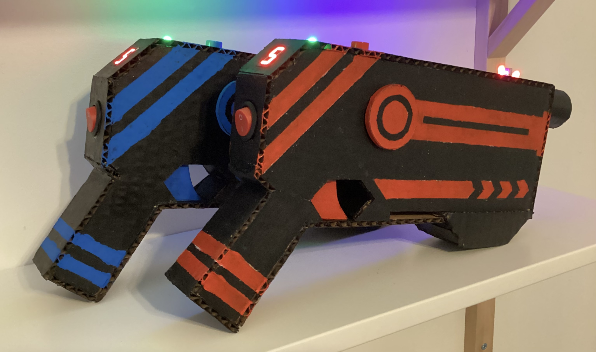
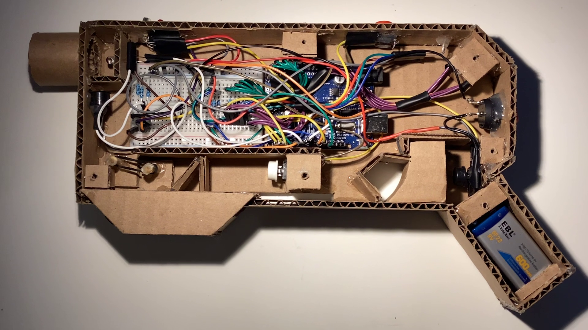
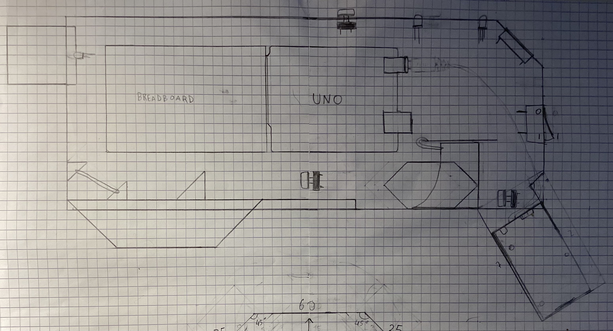
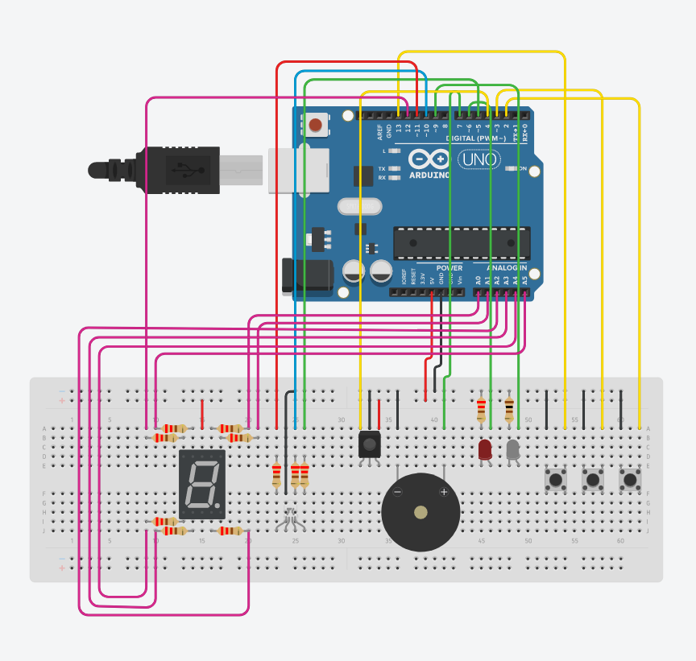

# Arduino Laser Tag

I created Laser Tag guns at home with Arduino and cardboard!
If you want to know more about the project, go check out my [video](https://youtu.be/cMQ6hUuC03o) about it (in French, with subtitles).

The code uses the [IRremote](https://github.com/Arduino-IRremote/Arduino-IRremote) library for infrared communication.

## Material

- 1x Arduino UNO : *controls everything*
- 3x Push buttons : *to shoot, reload and restart the game*
- 1x IR LED: *sends the infrared signal*
- 1x IR receiver : *receives the infrared signal*
- 2x Colored LEDs : *indicates when we get shot and also looks cool*
- 1x RGB LED : *displays our health points*
- 1x Passive buzzer : *plays sound effects*
- 1x 7-segment display : *displays our ammo counter*
- 1x On/off switch : *to turn the gun on and off*
- 1x 9V battery : *powers the gun*
- 1x Convex lens : *focuses the infrared light to increase range and accuracy*
- Cardboard

## Photos

## Wiring

